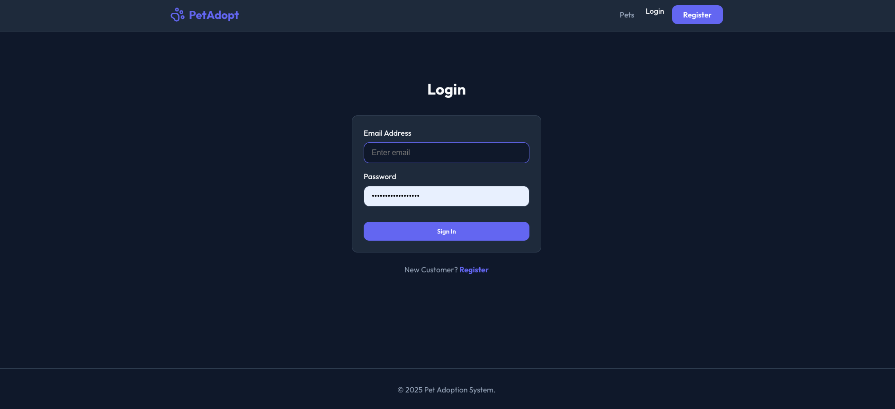
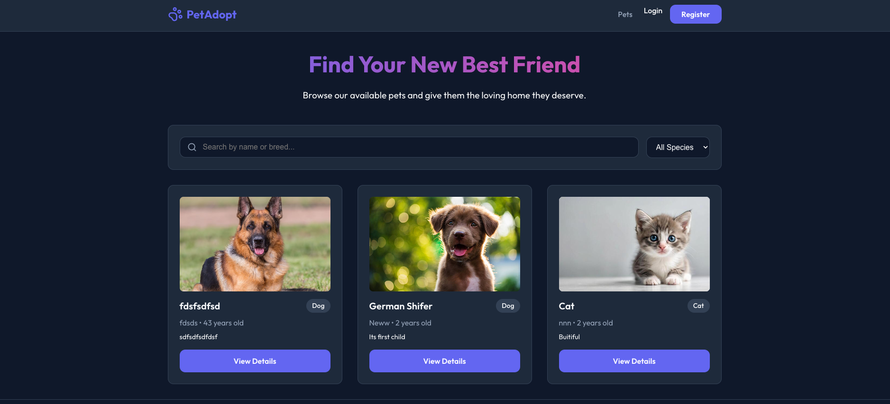
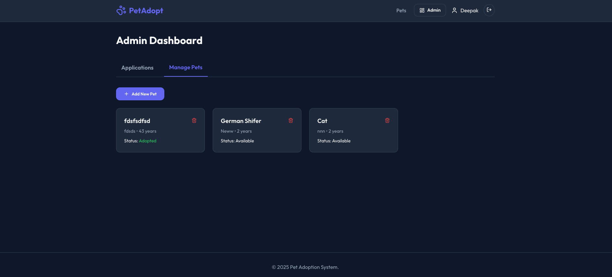
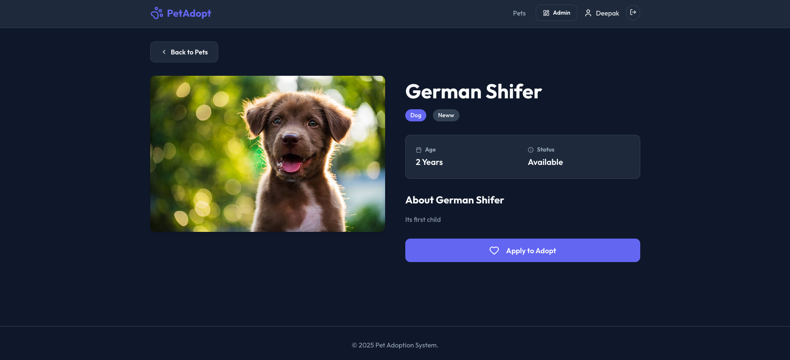

# Pet Adoption Management System

A full-stack web application designed to streamline the pet adoption process. This system facilitates the management of pet profiles, adoption applications, and user interactions, providing a seamless experience for both potential adopters and administrators.

## 🌟 Features

*   **User Authentication**: Secure Login and Registration system using JWT.
*   **Pet Management**:
    *   Browse available pets for adoption.
    *   View detailed profiles for each pet.
    *   Admins can add, update, and remove pet listings.
*   **Adoption Process**:
    *   Users can submit adoption applications for specific pets.
    *   User Dashboard to track application status (`My Applications`).
*   **Admin Dashboard**:
    *   Manage all pet listings.
    *   Review and manage adoption applications (Approve/Reject).
*   **Modern UI/UX**:
    *   Responsive design built with React and Vanilla CSS.
    *   Dark mode aesthetic with custom color variables.
    *   Interactive components and smooth animations.

## 📸 Screenshots

<div style="display: grid; grid-template-columns: repeat(2, 1fr); gap: 10px;">
  
  
  
  
</div>

## 🛠️ Technology Stack

### Backend
*   **Runtime**: Node.js
*   **Framework**: Express.js
*   **Language**: TypeScript
*   **Database**: MongoDB (with Mongoose ODM)
*   **Authentication**: JSON Web Tokens (JWT) & bcryptjs
*   **Validation**: Zod

### Frontend
*   **Library**: React
*   **Build Tool**: Vite
*   **Language**: TypeScript
*   **Styling**: Vanilla CSS (Custom Variables & Flexbox/Grid)
*   **Routing**: React Router DOM
*   **Icons**: Lucide React
*   **HTTP Client**: Axios

## 📋 Prerequisites

Before you begin, ensure you have the following installed:
*   **Node.js** (v14 or higher)
*   **npm** (Node Package Manager)
*   **MongoDB Atlas URI** (or a local MongoDB instance)

## 🚀 Getting Started

Follow these steps to set up and run the project locally.

### 1. Clone the Repository

```bash
git clone <repository-url>
cd "Pet Adoption Management System"
```

### 2. Backend Setup

Navigate to the backend directory and install dependencies:

```bash
cd backend
npm install
```

Create a `.env` file in the `backend` directory with the following variables:

```env
PORT=5001
MONGO_URI=your_mongodb_connection_string
JWT_SECRET=your_jwt_secret_key
```

### 3. Frontend Setup

Open a new terminal, navigate to the frontend directory, and install dependencies:

```bash
cd frontend
npm install
```

(Optional) If required, create a `.env` file for frontend environment variables (e.g., API URL), though the current setup might default to `http://localhost:5001`.

## 🏃‍♂️ Running the Application

You need to run both the backend and frontend servers concurrently.

### 1. Start the Backend Server

```bash
cd backend
npm run dev
```
*The server will start on `http://localhost:5001` (or your defined PORT).*

### 2. Start the Frontend Development Server

Open a new terminal window:
```bash
cd frontend
npm run dev 
```
*The application will be accessible at `http://localhost:5173` (default Vite port).*

## 🧪 Project Structure

```
Pet Adoption Management System/
├── backend/                # Node.js/Express Backend
│   ├── src/
│   │   ├── controllers/    # Request handlers
│   │   ├── models/         # Database schemas
│   │   ├── routes/         # API routes
│   │   ├── middleware/     # Auth & Error handling
│   │   └── index.ts        # Entry point
│   ├── package.json
│   └── tsconfig.json
│
├── frontend/               # React Frontend
│   ├── src/
│   │   ├── components/     # Reusable UI components
│   │   ├── pages/          # Page components (routes)
│   │   ├── assets/         # static assets
│   │   └── App.tsx         # Main app component
│   ├── index.css           # Global styles
│   ├── package.json
│   └── vite.config.ts
│
└── README.md
```

## 📝 API Documentation

The backend provides RESTful API endpoints. Common endpoints include:

*   **Auth**:
    *   `POST /api/auth/register` - Register a new user
    *   `POST /api/auth/login` - Login user
*   **Pets**:
    *   `GET /api/pets` - Get all pets
    *   `POST /api/pets` - Add a new pet (Admin only)
    *   `GET /api/pets/:id` - Get pet details
    *   `PUT /api/pets/:id` - Update pet (Admin only)
    *   `DELETE /api/pets/:id` - Delete pet (Admin only)
*   **Applications**:
    *   `POST /api/applications` - Submit adoption application
    *   `GET /api/applications` - Get user's applications
    *   `GET /api/applications/all` - Get all applications (Admin only)

## 🤝 Contributing

Contributions are welcome! Please fork the repository and create a pull request with your changes.

## 📄 License

This project is licensed under the ISC License.
# pet-adopt-system
